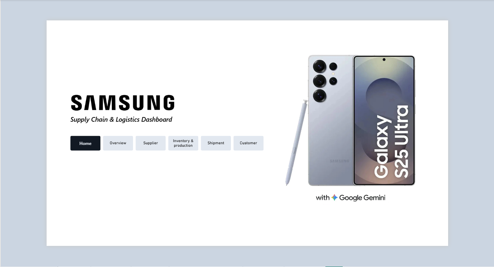
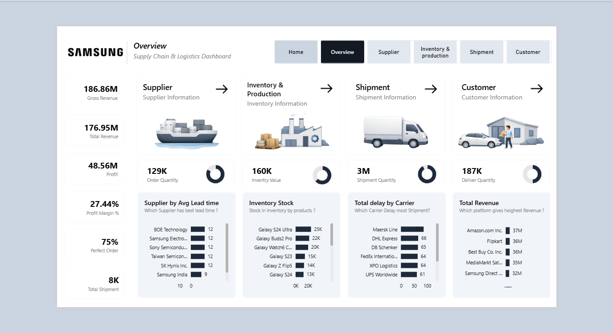
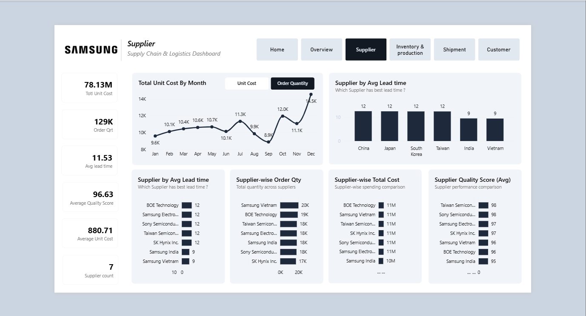
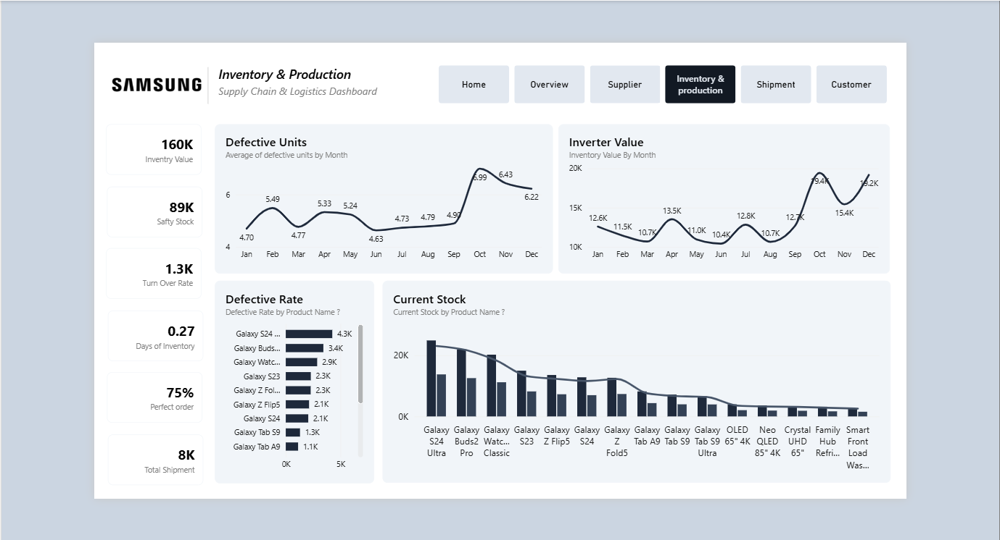
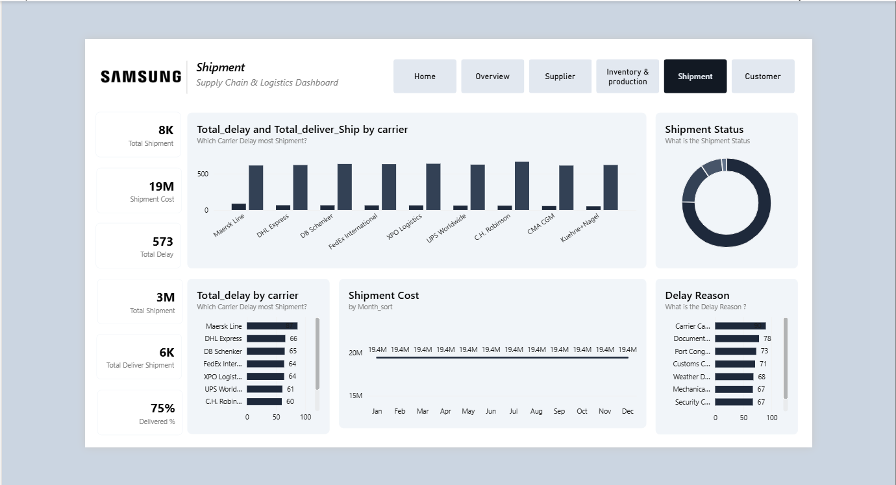
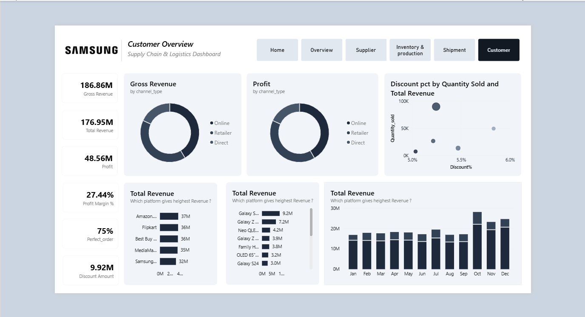
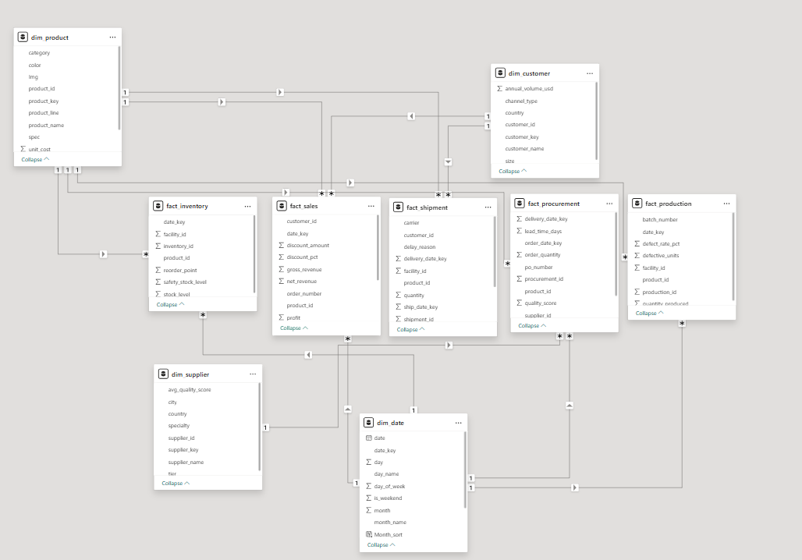

<div align="center">

# 📦 End-to-End Supply Chain Analytics Dashboard

### Transforming Supply Chain Data into Actionable Business Intelligence

<p align="center">

</p>

<p align="center">


</p>

---

*A comprehensive Business Intelligence solution designed to monitor and optimize the complete supply chain lifecycle—from supplier procurement to customer delivery—using interactive Power BI dashboards.*

</div>

---

# 📑 Table of Contents

- 📖 Project Overview
- 🎯 Business Problem
- 🚀 Objectives
- 📊 Dashboard Pages
- 📂 Dataset
- 🔄 Data Preparation
- 🧩 Data Model
- 📈 KPIs
- 💡 Business Questions
- 🛠 Tech Stack
- 📁 Repository Structure
- 🎯 Skills Demonstrated

---

# 📖 Project Overview

Modern supply chains generate massive volumes of operational data across procurement, manufacturing, warehousing, logistics, inventory, and customer sales. Without centralized reporting, identifying operational bottlenecks and making timely business decisions becomes increasingly difficult.

This project demonstrates an **End-to-End Supply Chain Analytics Dashboard** developed in **Power BI** that transforms raw operational data into meaningful business insights. The dashboard enables stakeholders to monitor supplier performance, inventory levels, production efficiency, shipment operations, and customer sales from a single interactive platform.

---

# 🎯 Business Problem

Supply chain managers frequently need answers to questions such as:

- Which suppliers consistently deliver on time?
- Which products have high inventory or stock shortages?
- Which logistics carriers experience the highest delays?
- Which products generate the most revenue?
- How efficiently is inventory managed?
- What factors impact overall supply chain performance?

Traditionally, these insights require manual reporting from multiple datasets, making the process slow and inefficient.

This dashboard centralizes supply chain data to enable faster analysis and data-driven decision making.

---

# 🚀 Project Objectives

✔ Monitor supplier performance

✔ Analyze inventory & production

✔ Track logistics and shipment performance

✔ Monitor customer revenue

✔ Build executive-level KPIs

✔ Improve operational visibility

✔ Enable faster business decisions

---

# 🖼 Dashboard Pages

## 🏠 Home

Provides an intuitive landing page for navigating all analytical dashboards.



---

## 📊 Executive Overview

Provides a high-level summary of the overall supply chain performance including procurement, inventory, logistics, and customer analytics.

### Highlights

- Gross Revenue
- Profit
- Inventory Value
- Shipment Quantity
- Customer Revenue
- Supplier Performance



---

## 🚢 Supplier Analytics

Analyzes supplier efficiency through procurement cost, order quantity, lead time, and supplier quality.

### Key Analysis

- Supplier Lead Time
- Supplier Cost
- Supplier Quality Score
- Procurement Trends
- Order Quantity



---

## 🏭 Inventory & Production

Monitors stock levels, production performance, inventory turnover, and defective products.

### Key Analysis

- Inventory Value
- Safety Stock
- Inventory Turnover
- Defective Units
- Current Stock



---

## 🚚 Shipment Analytics

Tracks logistics performance across shipment carriers.

### Key Analysis

- Shipment Cost
- Delivery Delay
- Shipment Status
- Delay Reasons
- Carrier Performance



---

## 👥 Customer Analytics

Provides customer and revenue insights.

### Key Analysis

- Revenue by Channel
- Revenue by Product
- Monthly Revenue
- Discount Analysis
- Customer Sales



---
# 📂 Dataset

The dashboard is built using multiple **CSV datasets** representing different stages of the supply chain lifecycle. Each dataset captures a specific business process, enabling comprehensive analysis across procurement, inventory, logistics, production, and customer sales.

### Dataset Includes

- 📦 Products
- 🏭 Inventory
- 🚚 Shipments
- 🤝 Suppliers
- 🏢 Manufacturing
- 📋 Orders
- 👥 Customers
- 💰 Sales & Revenue
- 📈 Procurement
- ⭐ Product Quality

---


---

# 🔄 Data Preparation

The raw datasets were transformed using **Power Query** to ensure data consistency, improve performance, and prepare the model for analytical reporting.

### Data Cleaning Steps

✔ Removed duplicate records

✔ Removed unnecessary columns

✔ Corrected data types

✔ Renamed columns for consistency

✔ Created relationships between datasets

✔ Optimized the data model

✔ Prepared analytical tables for reporting

---

# 🧩 Data Model

The dashboard follows a relational data model that connects procurement, inventory, shipments, suppliers, customers, and sales into a unified reporting structure.

The optimized model improves dashboard performance while enabling accurate KPI calculations and interactive filtering.

<p align="center">

</p>

---

# 📈 Key Performance Indicators

The dashboard tracks critical supply chain metrics across multiple business functions.

| KPI | Description |
|------|-------------|
| 💰 Gross Revenue | Total revenue generated before deductions |
| 💵 Total Revenue | Overall sales revenue |
| 📊 Profit | Net business profit |
| 📈 Profit Margin | Profitability percentage |
| 📦 Inventory Value | Total inventory valuation |
| 🔄 Inventory Turnover | Inventory movement efficiency |
| 🛡 Safety Stock | Available safety inventory |
| 🚚 Total Shipments | Number of shipments processed |
| ⏱ Lead Time | Supplier delivery performance |
| ⭐ Supplier Quality Score | Supplier quality evaluation |
| 📉 Shipment Cost | Total logistics cost |
| 📦 Perfect Orders | Successfully delivered orders |
| ⚠ Defective Units | Product quality monitoring |

---

# 💡 Business Questions Answered

This dashboard helps answer important operational questions such as:

- Which suppliers deliver the highest quality products?
- Which suppliers have the shortest lead times?
- Which products experience the highest defect rates?
- Which inventory items require replenishment?
- Which logistics carriers experience the most shipment delays?
- What are the major reasons behind delayed deliveries?
- Which products generate the highest revenue?
- Which sales channels contribute the most revenue?
- How does monthly revenue change over time?
- Is inventory sufficient to meet customer demand?

---

# 📈 Business Impact

This dashboard enables business stakeholders to:

- Improve supplier evaluation and procurement decisions.
- Optimize inventory levels to reduce stock shortages.
- Monitor logistics performance and shipment delays.
- Track product quality across the supply chain.
- Identify high-performing products and sales channels.
- Monitor profitability through interactive KPIs.
- Support strategic and operational decision-making with real-time insights.

---

# 🛠 Tech Stack

<p align="center">

| Technology | Purpose |
|------------|---------|
| 📊 **Power BI** | Dashboard Development |
| ⚡ **Power Query** | Data Cleaning & Transformation |
| 📈 **DAX** | KPI Calculations & Measures |
| 📄 **CSV Files** | Data Source |

</p>

---

# 📁 Repository Structure

```text
End-to-End-Supply-Chain-Analytics/
│
├── Dashboard/
│   └── End-to-End Supply Chain Analytics.pbix
│
├── Dataset/
│   ├── customers.csv
│   ├── inventory.csv
│   ├── orders.csv
│   ├── products.csv
│   ├── shipments.csv
│   ├── suppliers.csv
│   └── ...
│
├── Images/
│   ├── Home.png
│   ├── Overview.png
│   ├── Supplier.png
│   ├── Inventory.png
│   ├── Shipment.png
│   ├── Customer.png
│   ├── Dataset.png
│   └── DataModel.png
│
├── README.md
└── LICENSE
```
# 🎯 Skills Demonstrated

This project showcases practical Business Intelligence and Supply Chain Analytics skills, including:

- 📊 Interactive Dashboard Development
- 📈 Business Intelligence Reporting
- 🔄 Data Cleaning & Transformation (Power Query)
- 🧩 Data Modeling & Relationships
- 📐 DAX Measures & Calculated KPIs
- 📦 Supply Chain Analytics
- 🚚 Logistics & Shipment Analysis
- 🏭 Inventory Performance Monitoring
- 🤝 Supplier Performance Analysis
- 💰 Revenue & Profitability Analysis
- 📉 Trend & Performance Visualization
- 📊 Executive Dashboard Design

---

# ✨ Dashboard Features

### 📊 Executive Reporting

- High-level business KPIs
- Revenue & Profit Tracking
- Supply Chain Performance Overview

### 📦 Inventory Analytics

- Inventory Value
- Safety Stock
- Inventory Turnover
- Defective Products

### 🚚 Logistics Monitoring

- Shipment Tracking
- Carrier Performance
- Delivery Delays
- Shipment Costs

### 🤝 Supplier Insights

- Supplier Quality Score
- Procurement Cost
- Lead Time Analysis
- Order Quantity

### 👥 Customer Analytics

- Customer Revenue
- Sales by Channel
- Product Performance
- Monthly Revenue Trends

---

# 📈 Key Insights

This dashboard enables organizations to:

- Improve supplier selection using quality and lead-time analysis.
- Monitor inventory levels to reduce stock shortages and overstocking.
- Identify logistics bottlenecks affecting delivery performance.
- Analyze customer revenue across different sales channels.
- Track profitability through interactive KPIs.
- Support strategic business decisions using real-time analytics.

---

# 🚀 Project Highlights

- ✔ Developed an end-to-end Supply Chain Analytics Dashboard in Power BI.
- ✔ Designed multiple interactive dashboards for different business functions.
- ✔ Built an optimized relational data model for efficient reporting.
- ✔ Created business-focused KPIs using DAX.
- ✔ Applied Power Query to clean and transform raw datasets.
- ✔ Delivered an executive reporting solution for supply chain decision-making.

---

# 📸 Repository Contents

```
📦 End-to-End-Supply-Chain-Analytics
│
├── 📁 Dashboard
│   └── End-to-End Supply Chain Analytics.pbix
│
├── 📁 Dataset
│   └── CSV Files
│
├── 📁 Images
│   ├── Home.png
│   ├── Overview.png
│   ├── Supplier.png
│   ├── Inventory.png
│   ├── Shipment.png
│   ├── Customer.png
│   ├── Dataset.png
│   └── Model.png
│
├── 📄 README.md
└── 📄 LICENSE
```

---

# 💼 Ideal For

This project demonstrates skills relevant to roles such as:

- Data Analyst
- Business Intelligence Analyst
- Supply Chain Analyst
- Operations Analyst
- Power BI Developer

---

# ⭐ Support

If you found this project useful or inspiring, consider giving it a **⭐ Star** on GitHub.

It helps others discover the project and motivates future improvements.

---

<div align="center">

### 📦 End-to-End Supply Chain Analytics Dashboard

**Turning Operational Data into Actionable Business Intelligence**

⭐ **If you like this project, don't forget to star the repository!** ⭐

</div>
